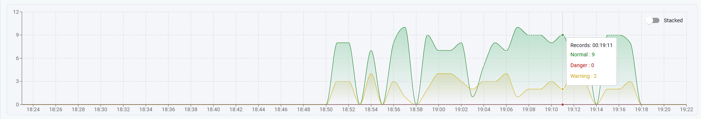

# IpClassify User Manual
Note that this application is not meant for production use. Many aspects of this implementations are not scalable in real world. This is by design to keep the software architecture as simple as possible.

## Accessing the software
In a development environment, application is available at hosts port 8082. API is hosted on host port 8080.

Ones you have navigated into the application, you will be greeted with authentication page. Base credentials have been set during an application installation. Refer [README](../README.md) for more information:

## Dashboard
Currently most of the application implementation is available at the home dashboard view:

On the left, you have ability to mock traffic. This is to stress test and benchmark the current data pipelines.

You have ability to filter out which kind of traffic you want. There is a difference between new traffic, which needs to be identified and cached, vs. already known traffic, which is already cached. **Note that there is API limitations on the free tier of the API we use to identify IPs**. Going over this limit may result in inaccurate access records.

There are also quick action buttons to use to switch how many requests you want to log at the same time. Currently there are no ON/OFF feature for consistent messages.

When you start sending traffic through, the live visualization should show almost near time the amount of traffic which has been processed:

By default the area chart is updated every second. You may switch between stacked mode and non-stacked. The messages are aggregated into three categories: **Normal**, **Warning** and **Danger**.
Currently you can only manually classify specific IP address or access record as certain level. This is possible via using context menu on **latest request table**.

You may classify the records in the following three ways:

* By record level
* By IP level
* By IP history level

Data is updated based the chosen level, and is automatically reflected in live chart.

Left bar is to show summarized data. These summarization also work as a filtering link to catalog pages.

## Catalog
Catalog is a fully powered access record history tool. This view enables advanced search queries based on access records.

**TODO**

## Details
Details page is a basic view for showing information about the IP

**TODO**